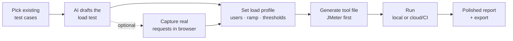

# ADR-003: Performance testing — scenario extraction & pluggable load-tool integration

**Status:** Proposed
**Date:** 2026-08-03
**Deciders:** Ahmed (owner)

## How it works (at a glance)

**Pick test cases → AI drafts the load test → set the load → run it → read the report.**



Only the **"AI drafts the load test"** step uses AI. Everything after it — generating the tool
file, running the load, parsing results, charts, and exports — is deterministic and AI-free.

## Context

QA Studio today generates and manages **functional** test cases (titles + `action`/`expected`
steps) across trackers (Azure DevOps, Jira + Xray, TestRail hybrids) and can already turn
those into **self-healing UI automation** (Selenium / Playwright / Cypress) via the
`automation_targets.py` "one shared IR → per-target emitter" design.

The ask is a **performance-testing** capability in two parts:

1. **Scenario extraction** — derive reusable *performance scenarios* (a user journey + its
   underlying requests, load profile, and assertions) **from existing test cases**, so teams
   don't hand-author load scripts from scratch.
2. **Tool integration** — a pluggable layer that **creates and runs** those scenarios against
   real load tools, **JMeter first**, with k6 / Locust / Gatling / cloud services able to plug
   in later without touching the core.

### Forces at play

- **Functional steps are prose, not requests.** A `Step` is `action`/`expected`/`data`/`pre`
  text (`tracker/models.py`). It contains user *intent* ("Submit the login form"), not the
  HTTP request, endpoint, payload, or think-time a load tool needs. Bridging that gap is the
  central technical problem of Feature 1.
- **The codebase has three reusable patterns we must not fight:**
  - *Normalized DTOs, adapters translate* — the "one rule" in `tracker/models.py`: core logic
    operates only on normalized types; vendor formats never leak past an adapter.
  - *One IR → per-target emitter* — `automation_targets.py` (`TARGETS = selenium/playwright/
    cypress`, each a `build_*_project`). Perf tools are the same shape.
  - *Capability ABC* — `tracker/base.py` uses an ABC + `Capability` flags so the UI can grey
    out unsupported actions without calling them.
- **Load generation is resource-heavy.** It cannot be a desktop-only, main-thread activity like
  the local functional Run. We already have a **local vs. remote** execution split
  (`run.py` local; `run_worker.py` on GitHub Actions) — perf runs must reuse it.
- **AI is a first-class dependency, not a bolt-on.** The engine already does AI compilation and
  evaluation (`engine.compile_test_case`, `evaluate_existing_steps`). Inferring request-level
  detail from step prose is a natural fit for the same engine.
- **Local-first & proprietary** — credentials stay on device (DPAPI), the app is proprietary
  (see `LICENSE`), and we bundle no heavyweight runtimes. Any tool the user must have installed
  (a JRE for JMeter) has to be detected, not silently assumed.

### Constraints

- Ship an MVP that is genuinely useful with **JMeter only**, but behind an abstraction that
  makes the second tool additive.
- No regression to the existing Setup → Run → Report flow; performance is a **new screen**,
  gated like Automation is (`regression.locked_state`).
- Reuse the normalized model and the remote-run worker rather than inventing parallel plumbing.

---

## Decision (summary)

Introduce a **normalized performance IR** (`PerfScenario` / `PerfResult`, new frozen dataclasses
alongside `tracker/models.py`) and two seams that mirror existing ones:

- **Feature 1 — Scenario Builder:** an `engine`-level extractor that turns `TestCase` → 
  `PerfScenario` using a **hybrid**: AI inference from step prose, optionally **enriched by a
  real browser/network capture** reusing the automation explorer. Output is tool-agnostic.
- **Feature 2 — Perf Targets:** a pluggable `PerfTarget` ABC (mirroring the tracker `Backend`
  ABC + `Capability` flags and the `automation_targets` emitter). `JMeterTarget` is the first
  implementation: it **emits** a `.jmx` project and **runs** it via the JMeter CLI, parsing the
  `.jtl` results back into the normalized `PerfResult`. k6 / Locust / Gatling / Azure Load
  Testing become new `PerfTarget`s with zero core changes.

Execution runs **locally** (desktop, JMeter non-GUI) for smoke loads and **remotely** (the
GitHub Actions worker) for real load, reusing the `remote_runs` pipeline.

---

## Decision 1 — Extracting performance scenarios from test cases

**Problem:** map functional `TestCase.steps` (prose) onto a load-tool-ready IR.

### The normalized IR (new, follows the `tracker/models.py` "one rule")

```python
@dataclass(frozen=True)
class PerfRequest:          # one protocol interaction
    method: str             # GET/POST/…               (empty for a pure think/wait)
    url: str                # templated: https://{host}/api/login
    headers: dict = ...     # normalized, secrets referenced not inlined
    body: str = ""          # payload template ({{ userId }})
    extract: list = ...     # correlations to pull from the response (token → var)
    assertions: list = ...  # status/latency/body assertions
    think_ms: int = 0       # pacing after this request
    source_step: str = ""   # back-ref to the originating Step (traceability)

@dataclass(frozen=True)
class PerfScenario:         # one user journey == one functional TestCase
    ref: Ref                # SAME identity as the TestCase it came from
    title: str
    requests: list          # list[PerfRequest]
    variables: dict = ...    # data-driven inputs (CSV-backed at emit time)
    story_ref: Ref = None

@dataclass(frozen=True)
class LoadProfile:          # HOW to drive a scenario — set by the user, not extracted
    users: int = 10
    ramp_up_s: int = 30
    duration_s: int = 300
    pacing_ms: int = 1000
    thresholds: dict = ...   # p95 < 800ms, error_rate < 1%
```

`PerfScenario` deliberately **carries the same `Ref`** as its source `TestCase`, so a perf run is
traceable back to the requirement (`Story`) exactly like functional runs are.

**Data-driven inputs (CSV upload) — first-class.** `variables` are the parameterized inputs a
scenario needs (`{{ email }}`, `{{ searchTerm }}`, `{{ productId }}`). The user can either let
QA Studio suggest sample data **or upload their own CSV** of real data and map its columns to the
variables. At emit time this becomes a JMeter **CSV Data Set Config** (requests use `${email}`),
or a k6 `SharedArray` from the same CSV — so each virtual user pulls a different row instead of
reusing one account. Handling rules: header row → column names; configurable recycle-on-EOF and
per-thread vs. shared sharing; UTF-8. **Sensitive columns** (passwords, tokens) are kept on-device
via `store.py` and passed to the remote worker only through the encrypted credential path — never
written into the generated project or committed.

### Options considered

#### Option A: AI-only inference from step prose
The engine reads each `Step.action/expected/data` and, with the `Story` context, asks the model
to emit `PerfRequest`s (method, endpoint guess, payload shape, correlations).

| Dimension | Assessment |
|-----------|------------|
| Complexity | Low — reuses the existing AI engine + normalized types |
| Cost | Low infra; per-extraction token cost |
| Accuracy | **Medium/low** — endpoints/payloads are *guessed* from UI prose; wrong for anything non-obvious |
| Team familiarity | High — same pattern as `compile_test_case` |

**Pros:** works with zero extra setup, offline of the SUT, immediate value.
**Cons:** hallucinated endpoints; no correlation of real tokens; needs heavy human review before a run is trustworthy.

#### Option B: Live capture only (reuse the automation explorer)
Drive the journey once in the instrumented browser the automation feature already uses, and
record the **real** network traffic (HAR-style) → `PerfRequest`s from ground truth.

| Dimension | Assessment |
|-----------|------------|
| Complexity | Medium/high — needs a network-capture layer on the explorer; desktop-only |
| Cost | Low infra |
| Accuracy | **High** — real endpoints, payloads, headers, timings |
| Team familiarity | Medium — extends existing explorer plumbing |

**Pros:** ground-truth requests and correlations; the load script actually matches the app.
**Cons:** requires a runnable SUT + credentials at build time; desktop-only; can't cover cases whose app isn't reachable.

#### Option C: Hybrid — AI draft, capture-enriched (recommended)
Extract an AI **draft** (Option A) as the always-available baseline, then let the user optionally
**enrich/verify** a scenario by replaying it through the capture explorer (Option B), which
overwrites guessed requests with real ones and auto-detects correlations. AI also fills the gaps
capture can't (assertions, meaningful variable names, think-time rationale).

| Dimension | Assessment |
|-----------|------------|
| Complexity | Medium — both paths, but each already has a home in the codebase |
| Cost | Low + token cost |
| Accuracy | **High when enriched, useful when not** |
| Team familiarity | High |

**Pros:** always produces something; upgrades to ground truth on demand; matches QA Studio's "AI draft you refine" ethos (same as Titles/Steps).
**Cons:** two code paths to maintain; capture path inherits the explorer's SUT-reachability requirement.

### Trade-off analysis
Option A alone ships a toy: guessed endpoints make load results meaningless. Option B alone is
accurate but unusable when the app isn't reachable at authoring time (common). The hybrid keeps
the **normalized IR identical** in both paths (the emitters never know which produced it), so it
costs one extra enrichment path for a large jump in trustworthiness — and it mirrors the product's
existing "AI proposes, human verifies" model. **Decision: Option C.**

---

## Decision 2 — Integrating with performance tools (JMeter first, pluggable)

**Problem:** create + run tool artifacts from `PerfScenario` + `LoadProfile`, and normalize
results — without coupling the core to any one tool.

### The seam (mirrors `tracker/base.py` + `automation_targets.py`)

```python
class PerfTarget(ABC):                 # one per tool, like a tracker Backend
    name: str                          # "jmeter"
    capabilities: set[PerfCapability]  # DISTRIBUTED, BROWSER, THRESHOLDS, CLOUD…

    @abstractmethod
    def emit(self, scenarios, profile, out_dir) -> ProjectPaths: ...
        # normalized IR → tool project (.jmx + data + run script). NEVER leaks
        # tool format back to the core — same rule as tracker adapters.

    @abstractmethod
    def run(self, project, on_event) -> PerfResult: ...
        # execute (local CLI or remote worker), stream live metrics via on_event,
        # parse tool output → normalized PerfResult.

    @abstractmethod
    def preflight(self) -> tuple[bool, str]: ...
        # is the tool available? (JMeter: find jmeter + a JRE). UI greys out if not.
```

`PerfResult` normalizes what every tool reports (samples, p50/p90/p95/p99, throughput, error
rate, per-request rollups, threshold pass/fail) so **Report** and email/export reuse the existing
`report.py` builders — the same way `ReportData` is kept "deliberately flat".

### `JMeterTarget` (first implementation)
- **emit:** render `PerfScenario` → a `.jmx` Test Plan (Thread Group from `LoadProfile`, HTTP
  Samplers from `PerfRequest`, CSV Data Set from `variables`, JSON/Regex extractors from
  `extract`, Response/Duration Assertions from `assertions`), plus a CSV of test data and a
  `run.bat`/`run.sh`. `.jmx` is generated from a template — **we never ask the user to touch
  XML** (which the 2026 tooling survey calls JMeter's biggest weakness).
- **run:** `jmeter -n -t plan.jmx -l results.jtl -e -o report/` (non-GUI), tailing `.jtl` for
  live metrics; parse `.jtl` + the HTML report → `PerfResult`.
- **preflight:** locate `jmeter`/`ApacheJMeter.jar` and a JRE; if missing, the UI shows an
  install hint instead of failing mid-run (same philosophy as `install.bat`'s Python bootstrap).

### Options considered

#### Option A: Hard-code JMeter into the perf screen
Fastest MVP; perf code calls JMeter directly.

**Pros:** least code now.
**Cons:** re-coupling we explicitly removed elsewhere; every future tool is a rewrite; violates the "adapters translate" rule the whole codebase is built on. **Rejected.**

#### Option B: Pluggable `PerfTarget` ABC, JMeter first (recommended)
One abstraction, JMeter as the first concrete target; k6/Locust/Gatling/cloud are additive.

| Dimension | Assessment |
|-----------|------------|
| Complexity | Medium — one ABC + one adapter now |
| Cost | Low |
| Scalability | High — new tools = new adapter, zero core change |
| Team familiarity | High — identical to tracker `Backend` + automation targets |

**Pros:** consistent with the entire architecture; UI capability-gates per tool; future-proof.
**Cons:** slightly more upfront structure than Option A.

#### Option C: Delegate to a meta-runner (Taurus / BlazeMeter YAML)
Author one YAML and let Taurus drive JMeter/k6/Gatling.

**Pros:** one emitter targets many engines.
**Cons:** adds a Python/Taurus runtime dependency and a second abstraction we don't control; obscures per-tool features; still needs the underlying tools installed. Better considered *inside* a future `PerfTarget` than as the core seam. **Deferred.**

#### Option D: Cloud-first (Azure Load Testing / Grafana Cloud k6)
Skip local engines; upload the scenario to a managed service.

**Pros:** real scale with no local load box; fits teams already on Azure DevOps.
**Cons:** cost + account setup; breaks "local-first"; not viable as the only option. **Kept as a future `PerfTarget`, not the MVP.**

### Trade-off analysis
The codebase has already paid the cost of the adapter pattern three times over (trackers,
automation targets, AI providers) and reaps it every time a new backend lands. A hard-coded
JMeter path (A) would be the one place that bucks that and would have to be torn out the moment
"and others" arrives — which the request explicitly anticipates. **Decision: Option B**, with C
and D as *implementations behind the same ABC* later.

### Execution model (cross-cutting)
Reuse the existing split rather than inventing one:
- **Local** (`run.py`-style): JMeter non-GUI for smoke/dev loads on the tester's box. Desktop-only, like the functional local Run.
- **Remote** (`run_worker.py` on GitHub Actions, `remote_runs` table): real load from CI, live
  metrics streamed to desktop/mobile via `remote_run_events`, exactly as functional remote runs
  already do. This is also how mobile gets perf runs at all (no local engine on a phone).

---

## Performance reporting & exporters

Results are **deterministic** (no AI) and reuse the same export path the Regression/Sprint reports
already use (Word / Excel / PDF / JSON / email via `report.py`), plus a polished modern in-app view.

**What a run report shows**
- **Scorecard** (top, glanceable): pass/fail vs `LoadProfile.thresholds`, p50/p90/p95/p99 latency,
  throughput (req/s), error rate, total samples, duration — big numbers, green/amber/red.
- **Trends** (charts): response-time percentiles over time, throughput, error rate, and active
  virtual users — the standard load-test time series.
- **Per-request table**: each `PerfRequest` with count, avg/p95, error %, and slowest calls,
  linked back to the originating `Step`/`Story`.
- **Compare to baseline**: this run vs the previous run (or a saved baseline), delta per metric,
  so regressions are obvious.

**Exporters** (reuse `report.py` builders — consistent with existing reports)
- **PDF** — a polished, branded one-pager for stakeholders (scorecard + key charts).
- **Excel** — raw samples + per-request rollups for deeper analysis.
- **Word** — narrative report (scorecard, charts, per-request table).
- **JSON** — machine-readable full result (CI gates, dashboards).
- **HTML** — a self-contained, shareable modern report (charts inline); the same view is shown in-app.
- **Email** — auto-attaches PDF + Excel with an inline summary, same as the Regression/Sprint email.

**CI gate**: JSON + threshold pass/fail is the hook to fail a pipeline when the p95 or error budget
is breached (the remote-run worker already runs in GitHub Actions).

*Optional AI add-on*: a one-paragraph **executive summary** of the run ("p95 rose 22% at 200 users,
driven by `/api/search`") — a single small AI call, off by default, metered like any other.

## AI involvement & approximate cost

**AI touches exactly one step — drafting the scenario from test-case prose (Feature 1).** Everything
else is deterministic:

| Stage | Uses AI? |
|-------|----------|
| Draft requests from a test case | **Yes** — one structured call per test case |
| Capture-enrich from a real browser session | No (records real traffic; tiny optional call to name variables/assertions) |
| Generate the JMeter `.jmx` | No (template) |
| Run the load test | No (JMeter/k6 does the work) |
| Parse results, charts, exports | No |
| Executive-summary paragraph | Optional, off by default |

**Rough token budget** per scenario (one test case → requests): ~**3,000 input** (system prompt +
steps + story context) + ~**1,200 output** (structured requests) ≈ 4.2K tokens.

**Approximate cost per test case** (Aug 2026 list prices; the app is bring-your-own-key and meters
every call in the AI-usage screen):

| Model | ~$ per test case | ~$ per 20-case suite |
|-------|------------------|----------------------|
| GPT-5 Mini ($0.25 / $2.00 per 1M) | ~$0.003 | ~$0.06 |
| Gemini 2.5 Flash ($0.30 / $2.50 per 1M) | ~$0.004 | ~$0.08 |
| Claude Haiku 4.5 ($1.00 / $5.00 per 1M) | ~$0.009 | ~$0.18 |
| Gemini free tier / Ollama (local) | **$0** | **$0** |

A whole suite costs **cents** on paid models and **nothing** on the free/local providers the app
already supports — and it's a **one-time authoring cost**, not per run (running a load test uses
zero AI). Prices move; treat these as order-of-magnitude.

## Consequences

**Becomes easier**
- Perf scenarios inherit requirement traceability for free (shared `Ref` → `Story`).
- Adding k6/Locust/Gatling/cloud is a self-contained adapter; the UI auto-gates on capabilities.
- Results flow through the existing `report.py`/email/export path.

**Becomes harder / new burden**
- A second IR (`PerfScenario`) and a contract suite to keep both emit paths honest (mirror the
  existing tracker contract tests).
- Tool preflight/availability UX (JRE/JMeter detection) and version drift across tools.
- The capture-enrichment path inherits the explorer's "SUT must be reachable" limitation.
- Secret handling for load (auth tokens, data) must reuse DPAPI/worker-credential paths, not a
  new store.

**To revisit**
- Whether k6 becomes the *default* target over JMeter (its 2026 code-first + AI/MCP story is
  strong and Git-friendly; JMeter's `.jmx`-in-Git pain is real).
- Distributed load beyond a single worker (multiple GitHub Actions runners / a cloud target).
- Whether `LoadProfile` deserves per-scenario presets stored on the tracker.

## Tool landscape (informing tool order)

| Tool | Script format | Strength | Fit for QA Studio |
|------|---------------|----------|-------------------|
| **JMeter** | `.jmx` XML (we generate it) | Ubiquitous; legacy protocols (JDBC/JMS); non-GUI CLI | **First target** — most-requested, template-emit avoids the XML pain |
| **k6** | JS | Code-first, CI/CD, Git-friendly; v2.0 (2026) ships an MCP server for AI agents | **Strong 2nd** — aligns with AI-first, easy to emit |
| **Locust** | Python | gevent → ~5× concurrency vs JMeter; plain `.py` | Good 3rd — pairs with the app's Python core |
| **Gatling** | Scala/Java DSL | Enterprise campaigns, rich reports | Later — heavier toolchain |
| **Azure Load Testing / Grafana Cloud k6** | managed | Real scale, no local box | Later — cloud `PerfTarget`, fits ADO users |

## Action items

**Phase 0 — IR & seam (no UI)**
1. [ ] Add `PerfRequest`/`PerfScenario`/`LoadProfile`/`PerfResult` frozen dataclasses next to `tracker/models.py`.
2. [ ] Define `PerfTarget` ABC + `PerfCapability` flags (mirror `tracker/base.py`).
3. [ ] Contract test skeleton (round-trip IR fidelity), mirroring the tracker contract suite.

**Phase 1 — Feature 1: Scenario Builder**
4. [ ] `engine.extract_perf_scenario(test_case, story)` → AI draft `PerfScenario` (Option A path).
5. [ ] Capture-enrichment: add network recording to the automation explorer; map HAR → `PerfRequest`; auto-correlate tokens (Option B path).
6. [ ] Review/edit UI: a "Performance" screen (gated via `regression.locked_state`) to pick test cases, extract, edit requests/variables, **upload a data CSV + map columns to variables**, set `LoadProfile`.
6b. [ ] CSV data binding: emit JMeter CSV Data Set Config / k6 `SharedArray`; recycle-on-EOF + sharing options; keep sensitive columns in `store.py`, pass to the worker via the encrypted credential path (never in the generated project).

**Phase 2 — Feature 2: JMeter target**
7. [ ] `JMeterTarget.emit` (IR → `.jmx` + CSV + run script from templates).
8. [ ] `JMeterTarget.preflight` (JMeter + JRE detection with install hint).
9. [ ] `JMeterTarget.run` local (non-GUI CLI) → parse `.jtl`/HTML report → `PerfResult`.
10. [ ] Live metrics + a perf Report view; reuse `report.py` export/email.

**Phase 3 — Scale & second tool**
11. [ ] Remote perf runs via the `remote_runs` worker (real load from CI, streamed events).
12. [ ] Add `k6Target` behind the same ABC to prove the seam (and evaluate default-tool switch).

## Alignment with existing architecture & roadmap constraints

Cross-checked against `DEV_ROADMAP.md` (which is a session changelog) and the existing ADRs.
Performance testing is **not currently tracked anywhere** — this is net-new scope — but the
roadmap encodes hard-won constraints this plan must honor, several of which the sections above
only implied:

1. **Weak/free-tier AI models are a first-class constraint (the biggest gap to close).** Repeated
   roadmap incidents (duplicate-detection false positives; Sprint-Plan effort estimation) show
   free-tier models can't be trusted with abstract judgments — and the fix each time was
   **structured output + a programmatic backstop + graceful degradation**, never better prose.
   Feature 1's `extract_perf_scenario` MUST follow the same discipline: force a structured
   `PerfRequest` schema, **validate every field programmatically** (drop/flag guessed endpoints,
   reject empty or degenerate extractions), and fall back to a minimal skeleton rather than a
   confident-but-wrong script. A load test built on a hallucinated endpoint is worse than none.

2. **Meter it through the existing AI-usage + credit-pause path.** Every AI call is tracked
   (`ai_usage_screen.py`) and runs **pause/resume** when a provider runs out of credits.
   Extraction is an AI call and must join that path — not a side channel — so spend stays visible
   and a mid-extraction credit-out pauses instead of crashing.

3. **Backend-agnostic + capability-gated from day one.** The roadmap's costliest recurring theme
   was retrofitting Azure-only features to other backends (ADR-001, ADR-002; automation RUN stayed
   "Azure-only" for many sessions). `PerfScenario` is derived from the **normalized** `TestCase`
   (any backend) and carries the same `Ref`; nothing in extraction or run may reach into a vendor
   payload. `PerfTarget.capabilities` gate the UI exactly like tracker capabilities do.

4. **Secrets reuse the existing stores.** Load auth tokens and data-driven secrets go through
   `store.py` (DPAPI) locally and the worker-credential RPC remotely (`run_worker.py`) — never a
   new secret store.

5. **Ship it as its own screen/module.** A new `performance.py` screen (mirroring `automation.py`
   / `regression.py`), gated via `regression.locked_state`, using `theme.py` tokens and the
   fail-soft `+ diag_log` pattern — extracted as a module, not bolted into `main.py` (~7,260 lines
   already).

6. **External engines are detected, never bundled.** JMeter needs a JRE; the app self-updates via
   a source **zipball** (`engine.apply_update`) and pins **Python 3.12**. `PerfTarget.preflight`
   detects the tool + runtime and shows an install hint (same philosophy as `install.bat`'s Python
   bootstrap); we do not add heavyweight runtimes to the install/update footprint.

7. **Dev discipline for the implementer.** Verify large-file edits **host-side** (a sandbox
   `py_compile` can be a stale-mount artifact — the #1248 incident); sync to the installed app via
   `_sync_to_install.py`, never shell `cp`; add a contract suite for the perf IR mirroring the
   tracker contract tests.

## Sources
- [JMeter vs k6 vs Locust in 2026 — QAInsights](https://qainsights.com/jmeter-vs-k6-vs-locust-in-2026-which-load-testing-tool-should-you-pick/)
- [Best Load Testing Tools 2026: JMeter vs Gatling vs k6 & more — Vervali](https://www.vervali.com/blog/best-load-testing-tools-in-2026-definitive-guide-to-jmeter-gatling-k6-loadrunner-locust-blazemeter-neoload-artillery-and-more/)
- [JMeter vs Gatling vs k6 — Benchmarks & CI/CD (2026) — Vervali](https://www.vervali.com/blog/jmeter-vs-gatling-vs-k6-the-complete-2026-comparison-benchmarks-ci-cd-scripting-and-use-cases/)
- [Best Performance Testing Tools 2026 — Crosscheck](https://crosscheck.cloud/blogs/best-performance-testing-tools-2026/)
