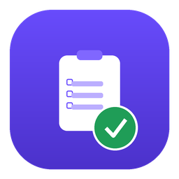

# QA Studio

**AI-powered Azure DevOps test-case generator** — titles + steps, Arabic or English output.
A single desktop window with a clean **Setup → Run → Report** flow.



---

## Quick install (Windows)

1. **Download** this repository:
   - Click the green **Code** button above → **Download ZIP**, then extract it.
   - *(or)* `git clone https://github.com/YOUR-USERNAME/qa-studio.git`

2. **Double-click `install.bat`.**
   It will:
   - Install Python automatically if it isn't already on your PC
   - Install all dependencies (Flet, Anthropic, Azure DevOps SDK, etc.)
   - Put a **QA Studio** icon on your Desktop

3. **Double-click the "QA Studio" icon** on your Desktop to open the app.

> If `install.bat` says Python was just installed, **close the window and run `install.bat` once more** so the new PATH takes effect.

---

## Manual install (any OS)

```bash
# 1. Install Python 3.9+ (3.11 or 3.12 recommended)

# 2. Install dependencies
pip install -r requirements.txt

# 3. Run the app
python main.py
```

Only the provider library you actually use is strictly required:
`anthropic` for Claude, `openai` for OpenAI/NVIDIA, `google-generativeai` for Gemini.

---

## First-time setup inside the app

1. Open **Setup → Connection** and enter:
   - **AI provider key** (Anthropic / OpenAI / Gemini / NVIDIA / Azure OpenAI / Ollama)
   - **Azure DevOps PAT** — needs **Work Items (read & write)** and **Test Management (read & write)** scopes
   - *(optional)* **Gmail App Password** for emailed reports
2. Pick your project, test plan, and the user stories to process.
3. Choose **Titles** or **Steps**, then **Run**.

Your keys, PAT, and Gmail password are saved **locally only** (base64) at
`~/.qa_tool/creds.dat` — they are never uploaded anywhere and are git-ignored.

---

## Files

| File | Purpose |
|------|---------|
| `main.py` | Flet UI — all screens and modals |
| `engine.py` | Azure DevOps + AI logic (no UI) |
| `theme.py` | Design tokens (colors, radii, fonts) |
| `store.py` | Local credential persistence |
| `install.bat` | Windows installer (deps + desktop icon) |
| `launch.bat` | Fallback launcher (no console window) |
| `requirements.txt` | Python dependencies |
| `app.ico` | App icon |

---

## Notes

- The window targets a desktop size (1120×760).
- Generated test content can be Arabic or English (toggle in Setup).
- For a no-Python standalone build later, Flet supports `flet build windows`.
