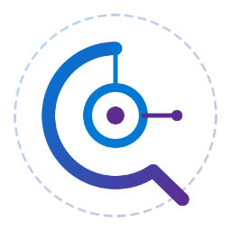

<div align="center">



# QA Studio

### AI test cases for Azure DevOps, in minutes

QA Studio reads your sprints &amp; stories and generates test-case titles or full steps —
in **English or Arabic** — straight into your Azure DevOps test plans.
One clean **Setup → Run → Report** flow.

<br>

[](https://github.com/AhmedSayedRepo/QA-Studio/releases/latest/download/install.bat)
&nbsp;
[](https://github.com/AhmedSayedRepo/QA-Studio/releases/latest)

**[🌐 Landing page](https://ahmedsayedrepo.github.io/QA-Studio/)** · **[📦 All releases &amp; changelog](https://github.com/AhmedSayedRepo/QA-Studio/releases)**

<sub>Windows 10/11 · Python auto-installed · your keys stay on your device</sub>

</div>

---

## Install

The fastest way — one small file, nothing to unzip, nothing to configure.

1. **Download** [`install.bat`](https://github.com/AhmedSayedRepo/QA-Studio/releases/latest/download/install.bat)
2. **Double-click it.** It installs Python if needed, pulls the app, adds dependencies, and drops a Desktop icon.
3. **Open QA Studio** from the new Desktop icon, add your keys in **Setup**, and run.

<details>
<summary>Prefer PowerShell?</summary>

```powershell
powershell -c "irm https://github.com/AhmedSayedRepo/QA-Studio/releases/latest/download/install.bat -OutFile $env:TEMP\install.bat; & $env:TEMP\install.bat"
```

</details>

> [!NOTE]
> Windows may show a blue **“Windows protected your PC”** notice for the `.bat` —
> click **More info → Run anyway**. This is the standard SmartScreen prompt for
> unsigned scripts; the installer is open and its source lives in this repo.

---

## What it does

| Stage | What happens |
|-------|--------------|
| **Setup** | Connect Azure DevOps, pick your AI provider, choose what to generate (titles or full steps) and the language. |
| **Run** | QA Studio reads the chosen sprint &amp; stories and writes test cases back into your test plans. |
| **Regression Plan** | Build a regression plan from existing test plans — weighted effort estimates, balanced across named resources. |
| **Sprint Plan** | Plan a sprint's testing scope, with an inline editable plan table and an email-ready report. |
| **Report** | Per-sprint summary with status breakdown — exportable to **Word · Excel · PDF · JSON** and shareable by email. |

---

## Highlights

- **Bilingual** — generate test cases in English *or* Arabic.
- **Effort estimation** — test cases × minutes × Azure DevOps priority weight → estimated hours, balanced across your team.
- **Editable plan tables** — inline-delete a story and the totals &amp; workload recalculate instantly.
- **Polished exports** — clean Word/Excel/PDF/JSON documents and an Outlook-safe HTML email report.
- **Useful Links** — keep your boards &amp; apps one click away, saved on your device.
- **Local-first** — credentials and links stay on your machine; nothing is uploaded anywhere but your own Azure DevOps and AI provider.

---

## Supported AI providers

Anthropic · OpenAI · Azure OpenAI · Google Gemini · NVIDIA · DeepSeek · Qwen · Ollama (local) · and more.

Add a key for any one of them in **Setup** — keys are stored locally and never leave your device except to call that provider.

---

## Requirements

- **Windows 10 or 11**
- An **Azure DevOps** account with access to the project you want to work in
- An **API key** for at least one supported AI provider
- Python — **installed automatically** by `install.bat` if it isn't already present

---

## Updating

Re-run `install.bat` (or the PowerShell one-liner) any time — it always pulls the
latest release. The [landing page](https://ahmedsayedrepo.github.io/QA-Studio/)
and download links always point to the newest version.

---

## Privacy

QA Studio runs entirely on your machine. Your Azure DevOps credentials and AI keys
are stored locally and are only ever sent to the services you explicitly connect
(your Azure DevOps organization and your chosen AI provider). No telemetry, no
third-party servers.

---

<div align="center">
<sub>QA Studio · Windows desktop app · built for Azure DevOps test teams</sub>
</div>
